# Поиск хайлайтов в видео на CLIP

Репозиторий содержит воспроизводимый пайплайн поиска хайлайтов в настоящих видео.

```text
mp4-видео / YouTube-видео -> эмбеддинги CLIP ViT-B/32 -> causal TCN -> интервалы хайлайтов
```



```mermaid
flowchart LR
    A["Входное видео<br/>mp4 / YouTube"] --> B["Сэмплирование кадров<br/>1 fps"]
    B --> C["CLIP ViT-B/32<br/>замороженный encoder"]
    C --> D["Кэш признаков<br/>.npz, 512-d embeddings"]
    D --> E["Сегментное усреднение<br/>окно 4 кадра"]
    E --> F0["Вход TCN<br/>T x 512"]
    F0 --> F1["Causal Conv1D block 1<br/>hidden=64, kernel=3"]
    F1 --> F2["ReLU + dropout<br/>dropout=0.4"]
    F2 --> F3["Causal Conv1D block 2<br/>hidden=64, dilation"]
    F3 --> F4["Residual connection<br/>стабилизация временного контекста"]
    F4 --> F5["Linear projection<br/>64 -> 1 logit на timestep"]
    F5 --> G["Sigmoid score timeline<br/>оценка важности по времени"]
    G --> H["Постобработка<br/>EMA, hysteresis, merge"]
    H --> I["Интервалы хайлайтов<br/>JSON + preview mp4"]
```

Исследовательский путь, эксперименты и обоснование финальной модели описаны в `EXPERIMENTS.md`. Итоговый отчёт находится в `stage2_clip_report.md`.

## Установка

```bash
python3 -m venv .venv
source .venv/bin/activate
python -m pip install --upgrade pip
pip install -r requirements.txt
```

## Данные

Используется MR.HiSum / TripleSumm-MR.HiSum — датасет пользовательских видео с YouTube, метаданными роликов и покадровой разметкой важности для video summarization. В локальную выборку скачано 1000 доступных роликов; после фильтрации пустых/битых кэшей используется 980 видео с CLIP-признаками при `1 fps`.

Из датасета берутся:

| Файл | Что используется |
|---|---|
| `data/raw/mrhisum_metadata.csv` | `youtube_id`, `video_id`, длительность и служебные метаданные |
| `data/raw/mrhisum_gt.h5` | непрерывные оценки важности и бинарные метки хайлайтов |
| `data/raw/mrhisum_split.json` | исходное разделение датасета, поверх которого применяется детерминированное перемешивание |

Подготовить локальную подвыборку и загрузить доступные YouTube-видео:

```bash
python -m src.highlights.cli prepare-mrhisum \
  --metadata data/raw/mrhisum_metadata.csv \
  --split-json data/raw/mrhisum_split.json \
  --target-count 1000 \
  --out data/manifests/mrhisum_subset.csv
```

## Извлечение признаков

```bash
python -m src.highlights.cli extract-features \
  --config configs/clip_tcn_mrhisum.yaml
```

Команда сэмплирует видео с частотой `1 fps`, запускает замороженный CLIP ViT-B/32 и сохраняет `.npz`-кэш в `data/features/`.

## Обучение

```bash
python -m src.highlights.cli train \
  --config configs/clip_tcn_mrhisum.yaml \
  --out-dir outputs
```

Обучается только causal TCN-голова поверх заранее сохранённых CLIP-эмбеддингов.

## Инференс

```bash
python -m src.highlights.cli infer \
  --config configs/clip_tcn_mrhisum.yaml \
  --checkpoint outputs/checkpoints/best.pt \
  --video samples/demo.mp4 \
  --out-dir outputs/demo
```

## Демо в Streamlit

```bash
streamlit run streamlit_app.py
```

Загрузить короткое видео, выбрать `configs/clip_tcn_mrhisum.yaml` и `outputs/checkpoints/best.pt`, затем запустить инференс. Приложение показывает исходное видео, временной ряд оценок, найденные интервалы, коэффициент скорости обработки и предпросмотр найденных хайлайтов.
