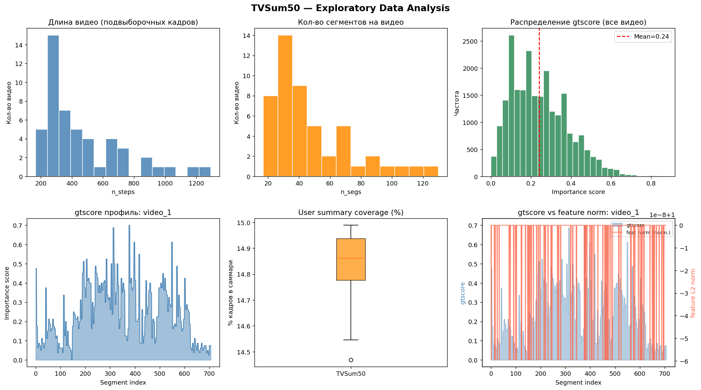
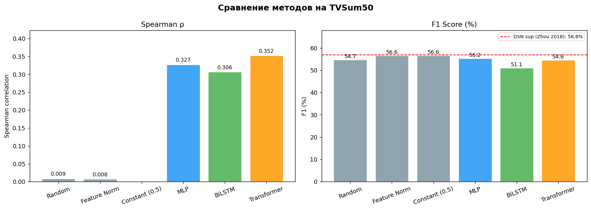
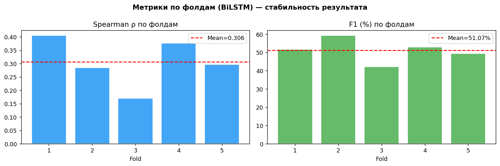
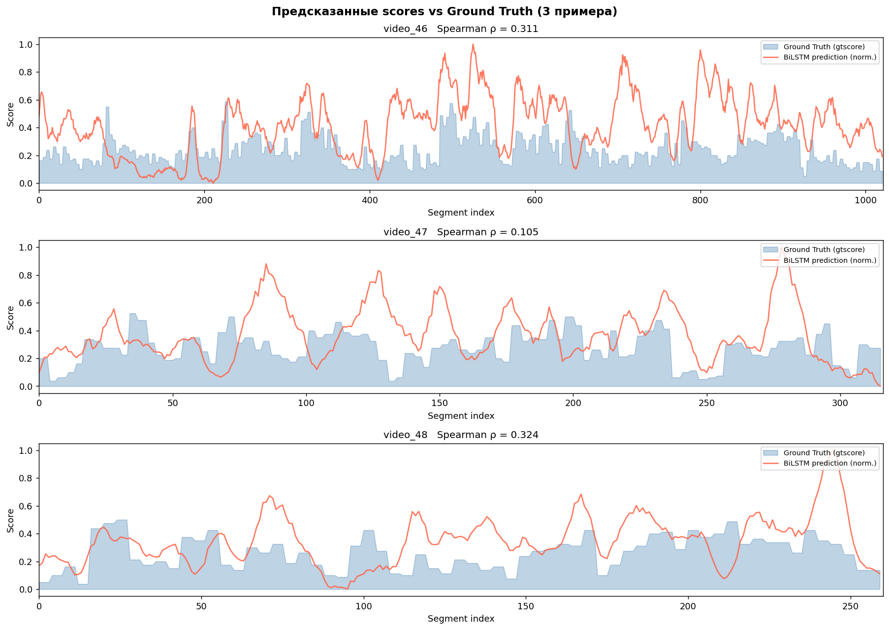

# Промежуточный отчет (этап 1)

## Проект
Поиск хайлайтов в видео (TVSum50)

## Что я сделал на этом этапе
На этом этапе был собран рабочий пайплайн для поиска хайлайтов по визуальным признакам.

Что вошло в работу:

1. Загрузка TVSum50 из `eccv16_dataset_tvsum_google_pool5.h5`.
2. Проверка структуры и целостности данных.
3. EDA: длины видео, число сегментов, распределение `gtscore`, coverage `user_summary`.
4. Реализация метрик: `Spearman` и `F1@15%`.
5. Baseline-методы: `Random`, `Feature Norm`, `Constant`.
6. Обучение моделей `MLP`, `BiLSTM`, `Transformer` в 5-fold CV.
7. Оценка скорости инференса и числа параметров.

Ключевой вывод на текущем этапе: результаты близкие, и на 50 видео разница порядка 1-2 п.п. по F1 может быть случайной. Поэтому выводы пока предварительные.

---

## 1. Данные

### Основные числа

| Показатель | Значение |
|---|---|
| Количество видео | 50 |
| Размер h5-файла | 125.1 MB |
| `n_steps` (min / max / mean) | 167 / 1294 / 470 |
| `n_frames` (min / max / mean) | 2500 / 19406 / 7047 |
| `n_segs` (min / max / mean) | 17 / 130 / 47.5 |
| Суммарные `n_steps` | 23510 |
| Суммарные кадры | 352353 |
| Оценка суммарной длительности | 3.27 часа (при ~2 fps) |

### Расшифровка проверок качества данных

| Проверка | Что означает | Результат |
|---|---|---|
| `non_monotonic_picks` | Индексы `picks` не должны идти назад по времени | 0 |
| `out_of_range_picks` | Все `picks` должны быть в диапазоне `[0, n_frames)` | 0 |
| `bad_change_points` | Границы сегментов должны быть валидными | 0 |
| `cp_seg_len_mismatch` | Длины сегментов из `change_points` и `n_frame_per_seg` должны совпадать | 0 |
| `empty_user_summary` | Разметка `user_summary` не должна быть пустой | 0 |
| `length_mismatch_feat_target` | Длины `features`, `gtscore`, `n_steps` должны совпадать | 0 |
| `nan_in_features` | В `features` не должно быть NaN | 0 |
| `nan_in_gtscore` | В `gtscore` не должно быть NaN | 0 |

Итого: базовая структура и целостность данных в порядке, критичных проблем на входе не найдено.

---

## 2. EDA

Что важно из графиков:

1. Длины видео и число сегментов заметно различаются между роликами.
2. Средний `gtscore` около 0.24, высоко-важные моменты встречаются реже.
3. `user_summary` покрывает около 15% кадров.
4. По графику `gtscore vs feature norm` нет устойчивой визуальной связи.

---

## 3. Метрики и результаты

### Метрики
- `Spearman`: насколько правильно метод ранжирует важность по времени.
- `F1@15%`: качество итогового summary относительно `user_summary`.

### Baseline-результаты

| Метод | Spearman | F1 (%) | Prec (%) | Rec (%) |
|---|---:|---:|---:|---:|
| Random | 0.0088 | 54.69 | 54.60 | 54.78 |
| Feature Norm | 0.0077 | 56.58 | 56.51 | 56.67 |
| Constant (0.5) | nan | 56.58 | 56.51 | 56.67 |

### Результаты моделей (5-fold CV, среднее по 50 тестовым видео)

| Модель | Spearman | F1 (%) | Prec (%) | Rec (%) |
|---|---:|---:|---:|---:|
| MLP | 0.3270 | 55.21 | 55.16 | 55.26 |
| BiLSTM | 0.3064 | 51.07 | 51.06 | 51.08 |
| Transformer | 0.3524 | 54.55 | 54.51 | 54.60 |

Интерпретация:
- По Spearman лучший результат у Transformer.
- По F1 разрыв между методами небольшой.
- На текущем объеме данных и разбросе по фолдам разница около 1-2 п.п. может быть шумом, поэтому о лучшем методе пока говорить рано.

---

## 4. Графики сравнения

Для BiLSTM по фолдам:
- Spearman: `0.3064 ± 0.0822`
- F1: `51.07% ± 5.49%`

Это подтверждает, что разброс по фолдам существенный, и стабильность результата так же важна, как среднее значение метрики.

---

## 5. Ресурсы и скорость

| Модель | Параметры | sec/video (CPU) | RTF |
|---|---:|---:|---:|
| MLP | 278,913 | 0.0007 | 0.000003 |
| BiLSTM | 2,924,929 | 0.0463 | 0.000197 |
| Transformer | 1,858,433 | 0.0068 | 0.000029 |

---

## 6. Пример предсказаний

---

## 7. Что можно сделать на следующем этапе

1. Подтюнить гиперпараметры и loss под F1.
2. Доработать шаг преобразования `score -> summary` (пороги, сглаживание, слияние интервалов).
3. Провести аналитику результатов в разрезе по параметрам видео.
