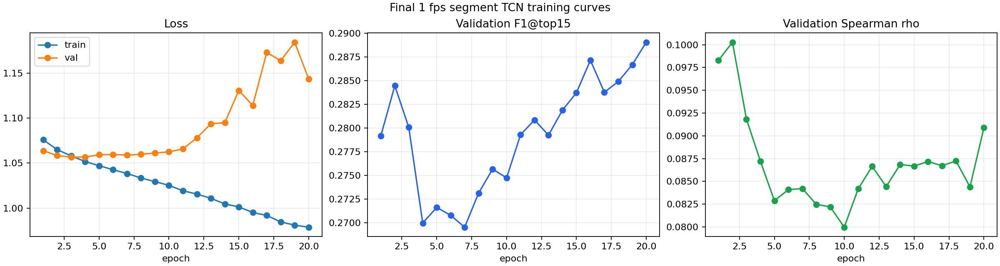
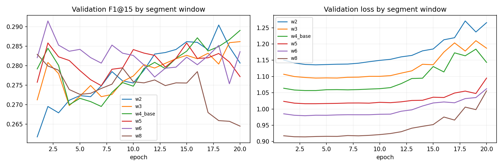
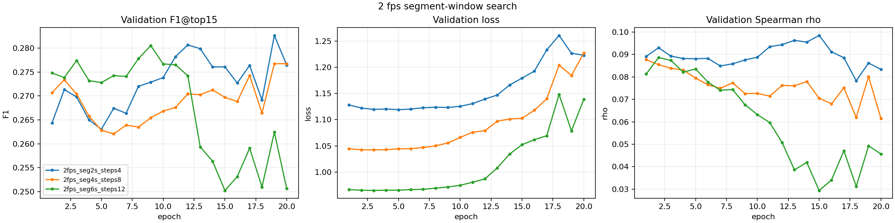
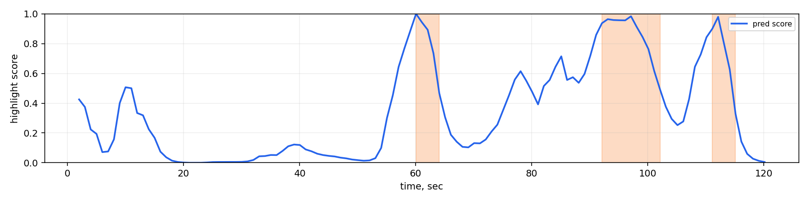

# Отчёт: поиск хайлайтов в настоящих видео

## 1. Цель работы

Цель работы — решить задачу поиска хайлайтов в реальных mp4-видео и собрать воспроизводимый пайплайн:

```text
mp4 / YouTube-видео -> эмбеддинги кадров CLIP -> временная модель -> оценки хайлайтов -> интервалы -> демо
```

Финальное решение делает ставку на практичность:

- работает с настоящими видео, а не только с табличными признаками;
- использует замороженный CLIP, поэтому обучение возможно на ноутбуке;
- обучает только лёгкую временную модель;
- умеет запускать инференс на произвольном коротком `.mp4`;
- предоставляет CLI, сохранённую контрольную точку, графики, метрики и демо в Streamlit.

## 2. Данные

Основной датасет — MR.HiSum / TripleSumm-MR.HiSum. Это набор пользовательских YouTube-видео для video summarization: для каждого ролика доступны метаданные, идентификатор YouTube и эталонная разметка важности по временной шкале. Такой формат позволяет обучать модель на настоящих видео, а не только на заранее подготовленных табличных признаках.

Из датасета используются:

| Файл | Назначение |
|---|---|
| `data/raw/mrhisum_metadata.csv` | `video_id`, `youtube_id`, длительность и служебные метаданные |
| `data/raw/mrhisum_gt.h5` | непрерывные оценки важности и бинарные метки хайлайтов |
| `data/raw/mrhisum_split.json` | исходное разделение датасета |
| `data/manifests/mrhisum_subset.csv` | локальный манифест скачанных и пропущенных видео |

Итоговая локальная выборка:

| Показатель | Значение |
|---|---:|
| Строк в манифесте | 1080 |
| Успешно скачано видео | 1000 |
| Недоступно / не скачано | 80 |
| Кэш признаков при 1 fps | 980 |
| Размер кэша признаков | около 357 MB |

Для финального обучения использовалось детерминированное перемешивание, чтобы тест не участвовал в выборе контрольной точки:

| Раздел | Логика |
|---|---|
| Обучение | около 80% по hash(`seed:video_id`) |
| Валидация | около 10%, только для выбора контрольной точки и гиперпараметров |
| Тест | около 10%, только финальная оценка |
| Seed | `20260517` |

## 3. Архитектура

Финальный пайплайн:

```text
видео -> кадры при 1 fps -> CLIP ViT-B/32 -> сегментное усреднение -> causal TCN -> сигмоидные оценки -> постобработка
```

### 3.1 CLIP-кодировщик

Используется CLIP ViT-B/32 с предобученными весами `openai`.

Особенности:

- CLIP полностью заморожен;
- на диск сохраняются `.npz`-файлы кэша;
- обучение не требует повторно прогонять CLIP;
- инференс на новом видео выполняет извлечение CLIP-признаков только для этого видео.

Почему CLIP:

- качество визуальных признаков выше, чем у лёгких CNN вроде MobileNet;
- признаки универсальны и подходят для разных жанров видео;
- замороженный кодировщик реалистичен для ноутбука;
- ViT-B/32 остаётся достаточно быстрым для демо на коротких видео.

### 3.2 Сегментное усреднение

Перед временной моделью используется окно из 4 соседних CLIP-векторов:

```text
feature_segment[t] = mean(CLIP[t : t + 4])
target_segment[t] = max(summary_label[t : t + 4])
```

Это оказалось самым полезным изменением: модель получает локальный контекст и перестаёт реагировать на одиночные шумные кадры.

### 3.3 Временная голова

Финальная временная модель — causal TCN:

| Параметр | Значение |
|---|---:|
| `input_dim` | 512 |
| `hidden_dim` | 64 |
| `levels` | 2 |
| `kernel_size` | 3 |
| прореживание (`dropout`) | 0.4 |
| `causal` | true |
| `lookahead_steps` | 0 |

Почему causal-модель:

- модель не использует будущие кадры;
- её проще объяснить как решение, близкое к реальному времени;
- двунаправленные варианты и варианты с заглядыванием вперёд проверялись, но не дали достаточно выигрыша по F1.

## 4. Обучение

Финальный конфиг: `configs/clip_tcn_mrhisum.yaml`.

Обучаемые параметры есть только у TCN-головы. CLIP остаётся замороженным.

Loss:

```text
L = BCEWithLogits(pos_weight)(logits, y)
    + 0.5 * pairwise_rank_loss(sigmoid(logits), y)
    + 0.05 * temporal_smoothness(sigmoid(logits))
```

Интерпретация:

- weighted BCE борется с дисбалансом, потому что метки хайлайтов редкие;
- pairwise ranking заставляет важные моменты иметь оценку выше неважных;
- temporal smoothness делает временной ряд менее рваным и удобнее для выделения интервалов.

Графики финального обучения:



Лучшая контрольная точка на валидации по F1@top15:

| Эпоха | Потери на обучении | Потери на валидации | F1@top15 на валидации | Spearman на валидации |
|---:|---:|---:|---:|---:|
| 20 | 0.9789 | 1.1434 | 0.2891 | 0.0909 |

На графике видно переобучение по loss: потери на обучении продолжают снижаться, а потери на валидации растут. Поэтому финальный выбор делался не по одному loss, а по набору метрик и тестовой проверке короткого списка моделей. Это важная методологическая оговорка: loss не полностью отражает качество ранжирования хайлайтов.

## 5. Метрики качества

Для задачи поиска хайлайтов одной accuracy недостаточно. Использовались несколько метрик.

| Метрика | Что измеряет | Почему важна |
|---|---|---|
| F1@top15 по сводке | Берём верхние 15% моментов по оценке модели и сравниваем с эталонной маской сводки | Основная метрика для задачи "собрать короткую нарезку" |
| Spearman по сводке | Ранговая корреляция предсказанных оценок с бинарными метками сводки | Показывает, насколько временной ряд оценок согласован с эталоном без фиксированного порога |
| Spearman по оценкам | Ранговая корреляция с непрерывной оценкой важности из MR.HiSum | Полезна для анализа качества ранжирования, но не всегда совпадает с бинарными хайлайтами |
| Попадание top-1 | Попал ли самый высокий пик модели в эталонный хайлайт | Важно для демо: главный пик должен быть осмысленным |
| Jitter | Средняя волатильность временного ряда оценок | Чем ниже, тем проще получить чистые интервалы без дробления |
| Коэффициент скорости | `processing_sec / duration_sec` | Показывает пригодность для инференса, близкого к реальному времени |

Финальная оценка на тесте:

| Модель | Видео в тесте | F1@top15 | Spearman по сводке | Spearman по оценкам | Попадание top-1 | Jitter |
|---|---:|---:|---:|---:|---:|---:|
| Финальная TCN с сегментами при 1 fps | 98 | 0.2849 | 0.1367 | 0.0750 | 0.3776 | 0.0259 |
| Победитель валидации с 3 уровнями | 98 | 0.2803 | 0.1425 | 0.0965 | 0.3980 | 0.0194 |

Интерпретация:

- вариант с `levels=3` имел лучший F1 на валидации, но хуже F1 на тесте, поэтому не выбран;
- финальный вариант с `levels=2` даёт лучший F1@top15 на тесте и проще для объяснения;
- Spearman остаётся умеренным: визуальные CLIP-признаки не всегда совпадают с субъективной человеческой оценкой важности;
- jitter у финальной модели низкий, поэтому постобработка получает достаточно гладкие интервалы.

## 6. Сравнение подходов

Подробная таблица экспериментов находится в `EXPERIMENTS.md`. Ключевые выводы:

| Направление | Лучший результат / вывод |
|---|---|
| Регрессия непрерывной оценки | Работает хуже бинарных меток сводки, часто даёт плоский временной ряд оценок |
| BCE + pairwise ranking | Стало основой финального loss |
| Focal + Dice | Не улучшило F1; иногда переусиливало редкие положительные метки |
| Temporal smoothness | Улучшает читаемость временного ряда и слегка помогает валидации |
| Аугментация признаков | Повысила F1 на валидации, но ухудшила тест; не включена |
| Двунаправленность / заглядывание вперёд | Может поднять rho, но снижает F1 и ухудшает трактовку как решения близкого к реальному времени |
| Сегментное усреднение | Наиболее полезное изменение; выбрано в финале |
| 2 fps | Увеличивает стоимость извлечения признаков примерно вдвое, но не улучшил F1 на валидации |

Графики поиска окна сегмента:





## 7. Инференс и демо

CLI-инференс:

```bash
python -m src.highlights.cli infer \
  --config configs/clip_tcn_mrhisum.yaml \
  --checkpoint outputs/checkpoints/best.pt \
  --video samples/demo.mp4 \
  --out-dir outputs/demo
```

Демо в Streamlit:

```bash
streamlit run streamlit_app.py
```

Артефакты демо:

| Файл | Содержание |
|---|---|
| `outputs/demo/scores.json` | временные метки, сырые оценки, нормализованные оценки, время обработки, коэффициент скорости |
| `outputs/demo/highlights.json` | найденные интервалы |
| `outputs/demo/timeline.png` | визуальный временной ряд оценок |
| `outputs/demo/highlight_preview.mp4` | короткая склейка найденных хайлайтов |

Результат на `samples/demo.mp4`:

| Показатель | Значение |
|---|---:|
| Длительность видео | 121.55 сек |
| Время обработки | 4.49 сек |
| Коэффициент скорости | 0.0369 |

Найденные интервалы:

| Начало | Конец | Оценка |
|---:|---:|---:|
| 60.06 | 64.06 | 0.8167 |
| 92.09 | 102.10 | 0.8772 |
| 111.11 | 115.12 | 0.7846 |

Временной ряд:



## 8. Ограничения

- Модель использует только визуальный поток: нет аудио, субтитров и признаков движения.
- CLIP заморожен, поэтому модель не адаптирует визуальный кодировщик под MR.HiSum.
- GT субъективен: разные пользователи могут выбирать разные хайлайты.
- 1 fps достаточно для MVP, но может пропустить короткие события.
- F1 на тесте около 0.285 показывает, что задача остаётся сложной.
